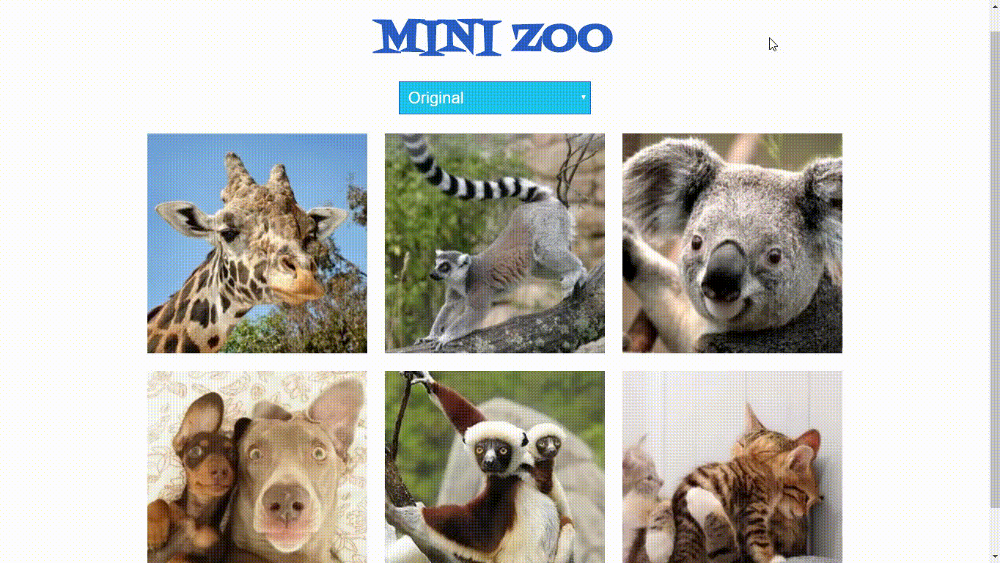

# Mini-Zoo

* **Unidad:** _Maquetado web con HTML & CSS_

***

El reto consiste en mostrar una serie de imagenes de animales en diferentes tipos de tono de color como es estilo _SEPIA_ , _BLANCO y NEGRO_ e  _INVERTIR COLORES_.

## Objetivo

Hacer uso de DOM y CSS, para replicar el siguiente resultado a lograr:

## Resultados

* Cumple con los requisitos del resultado a lograr, además se añadio mejores estilos a la página, logrando una mejor visualización.

* Se añadio dos elementos de tipo `option`: 
1. Tipo de animal
2. Tono de color

* El resultado fue el siguiente [sitio original](https://jessica2011.github.io/mini-zoo/)

 

